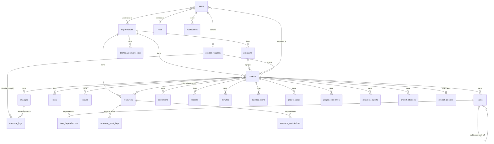

# Analisis Completo - PMO_APP Platform

**Fecha:** 6 de abril de 2026
**Version:** 2.0 (post-cierre de gaps)

---

## 1. Resumen Ejecutivo

PMO_APP es una plataforma moderna de gestion de portafolio de proyectos (PMO) construida con una arquitectura API-first desacoplada. Fue comparada contra el sistema DRC-PMO (Laravel) y, tras cerrar los gaps identificados, ahora **cubre el 100% de las funcionalidades base** del DRC-PMO y **supera en 15+ areas**.

### Stack Tecnologico

| Componente | Tecnologia |
|-----------|-----------|
| **Backend** | FastAPI (Python 3.11+) + SQLAlchemy 2.0 |
| **Frontend** | React 19 + TypeScript + Vite + Tailwind CSS 4 |
| **Base de Datos** | MySQL 8.0 |
| **Motor IA** | Ollama (Qwen 2.5 7B local) + Claude API (fallback) |
| **Importacion MS Project** | mpxj (Java) |
| **Autenticacion** | JWT (python-jose) + bcrypt |
| **Internacionalizacion** | react-i18next (ES/EN) |

---

## 2. Arquitectura del Sistema

```
┌─────────────────────────────────────────────────────────┐
│                    FRONTEND (React SPA)                  │
│  React 19 + TypeScript + Vite + Tailwind CSS 4          │
│  Recharts (graficas) | i18n (ES/EN) | Branding System   │
├─────────────────────────────────────────────────────────┤
│                         REST API                         │
│                   (JWT Bearer Token)                     │
├─────────────────────────────────────────────────────────┤
│                   BACKEND (FastAPI)                       │
│  28 API Routers | Pydantic Schemas | SQLAlchemy ORM      │
│                                                          │
│  ┌──────────┐ ┌──────────┐ ┌──────────┐ ┌──────────┐   │
│  │ Services │ │   Auth   │ │  Audit   │ │   Folio  │   │
│  │ AI Engine│ │ Security │ │ Logging  │ │Generator │   │
│  │ Notific. │ │  JWT/BC  │ │          │ │          │   │
│  └──────────┘ └──────────┘ └──────────┘ └──────────┘   │
├─────────────────────────────────────────────────────────┤
│                      MySQL 8.0                           │
│            26 tablas + soft delete universal              │
├─────────────────────────────────────────────────────────┤
│              INTEGRACIONES EXTERNAS                       │
│  Ollama (IA local) | Claude API | mpxj (MS Project)     │
└─────────────────────────────────────────────────────────┘
```

---

## 3. Modelo de Datos (26 tablas)

### 3.1 Tablas Principales

| Tabla | Descripcion | Folio |
|-------|-------------|-------|
| `users` | Usuarios del sistema con auth JWT | - |
| `roles` | 4 roles del sistema | - |
| `permissions` | Permisos granulares modulo/accion | - |
| `organizations` | Empresas/clientes (multi-tenant) | - |
| `programs` | Agrupacion de proyectos (portafolio) | - |
| `projects` | Proyectos con fases, salud, presupuesto | PRJ-YYYY-NNN |
| `project_requests` | Solicitudes de proyecto con flujo de aprobacion | REQ-YYYY-NNN |
| `tasks` | Tareas con WBS, jerarquia, importacion MPP | - |
| `task_dependencies` | Dependencias entre tareas (FS/SS/FF/SF) | - |
| `risks` | Registro de riesgos con severidad calculada | RSK-YYYY-NNN |
| `issues` | AIDs: Acciones, Incidencias, Decisiones | INC-YYYY-NNN |
| `changes` | Solicitudes de cambio con aprobacion | CHG-YYYY-NNN |
| `documents` | Documentos de proyecto (archivos + links) | DOC-YYYY-NNN |
| `lessons` | Lecciones aprendidas | LEC-YYYY-NNN |
| `minutes` | Minutas de reunion (manual + IA) | MIN-YYYY-NNN |
| `backlog_items` | Backlog de producto/funcionalidades | BLG-YYYY-NNN |
| `project_areas` | Areas/stakeholders del proyecto | ARE-YYYY-NNN |
| `project_objectives` | Objetivos y KPIs del proyecto | - |
| `progress_reports` | Reportes de avance generados con IA | - |
| `resources` | **[NUEVO]** Recursos dedicados con tarifa y tipo | REC-YYYY-NNN |
| `resource_work_logs` | **[NUEVO]** Bitacora de horas trabajadas | - |
| `resource_availabilities` | **[NUEVO]** Disponibilidad de recursos | - |
| `project_statuses` | **[NUEVO]** Estatus periodico (snapshots) | - |
| `project_closures` | **[NUEVO]** Cierre formal de proyecto (1:1) | - |
| `dashboard_share_links` | **[NUEVO]** Links publicos de dashboard | - |
| `approval_logs` | **[NUEVO]** Historial polimorfico de aprobaciones | - |
| `project_resources` | Pivote proyecto-recurso con % asignacion | - |
| `notifications` | Notificaciones in-app (9 tipos) | - |
| `audit_log` | Log de auditoria | - |

### 3.2 Diagrama de Relaciones



---

## 4. Roles y Permisos

### 4.1 Roles del Sistema

| Rol | Descripcion |
|-----|-------------|
| **Administrador** | Acceso total a todos los modulos y configuracion del sistema |
| **PMO Manager** | Gestion de portafolio: ver, crear, editar proyectos y modulos |
| **Project Manager** | Gestion de sus proyectos asignados y todos los sub-modulos |
| **Viewer** | Solo lectura en todos los modulos visibles |

### 4.2 Permisos Granulares

- **9 modulos:** projects, risks, issues, changes, documents, lessons, minutes, admin, organizations
- **4 acciones:** view, create, edit, delete
- **36 permisos** combinados en matriz rol-modulo-accion
- Roles de proyecto: `pm`, `member`, `stakeholder`

### 4.3 Seguridad

- JWT con expiracion configurable (default 24h)
- Bloqueo de cuenta tras 5 intentos fallidos (15 min)
- Hashing bcrypt para contrasenas
- Preguntas de seguridad opcionales
- Soft delete en todos los modelos (datos recuperables)
- Logs de auditoria en operaciones criticas

---

## 5. Modulos Funcionales

### 5.1 Dashboard Ejecutivo (`/api/dashboard/kpis`)
**Metricas incluidas:**
- Proyectos activos (conteo)
- Solicitudes en revision
- Riesgos abiertos / riesgos severos (severidad >= 13)
- Cambios en revision
- AIDs abiertos
- Presupuesto total / real / varianza
- Progreso promedio
- **[NUEVO]** Proyectos por fase (Planificacion, Ejecucion, Soporte, Cerrado)
- **[NUEVO]** Proyectos por salud (verde, amarillo, rojo)
- **[NUEVO]** Proyectos por tipo
- **[NUEVO]** Top 10 proyectos por progreso
- **[NUEVO]** Total de recursos activos
- Filtro por organizacion

### 5.2 Dashboard Compartido (`/api/dashboard-share`)
- **[NUEVO]** Links publicos con token unico
- PIN encriptado opcional (bcrypt)
- Fecha de expiracion configurable
- Metricas filtradas por organizacion
- No requiere autenticacion para acceder

### 5.3 Solicitudes de Proyecto (`/api/requests`)
- Folio automatico REQ-YYYY-NNN
- Campos: titulo, descripcion, objetivo, unidad de negocio, departamento, patrocinador, alineacion estrategica, beneficios, presupuesto, consecuencia de no ejecutar, stakeholders, entregables
- Flujo: in_review -> approved / rejected / cancelled / info_requested
- **[NUEVO]** Historial de aprobaciones via ApprovalLog polimorfico
- **[NUEVO]** Registro en log de auditoria

### 5.4 Gestion de Proyectos (`/api/projects`)
- Folio automatico PRJ-YYYY-NNN
- Fases: Planificacion, Ejecucion, Soporte, Cerrado
- Salud/semaforo: green, yellow, red
- Prioridad: Alta, Media, Baja
- Presupuesto planificado vs real
- Progreso planificado vs real
- Vinculacion a programa y organizacion
- Filtros avanzados: fase, empresa, tipo, prioridad, fechas, programa

### 5.5 Tareas (`/api/tasks`)
- **Creacion manual** (ventaja sobre DRC-PMO que solo permite importacion)
- Importacion desde .mpp/.mpx/.xml/.xlsx/.csv
- WBS jerarquico con outline_level
- Hitos (milestones)
- Estados: pending, in_progress, completed, delayed
- **Tracking de retrasos:** was_delayed + original_end_date
- Dependencias entre tareas (FS/SS/FF/SF)
- Asignacion a responsables

### 5.6 Recursos (`/api/resources`) **[NUEVO]**
- Folio automatico REC-YYYY-NNN
- Perfil completo: nombre, email, puesto, departamento, ubicacion, telefonos
- Tipo: human, equipment, material
- Interno vs externo
- Tarifa por hora con periodo (hora/dia/mes)
- Horas trabajadas acumuladas
- Vinculacion opcional a usuario del sistema
- Asignacion a proyectos con % de asignacion y rol
- Bitacora de horas (work logs) por recurso/proyecto/tarea/fecha
- Disponibilidad por fecha (horas disponibles 0-24)

### 5.7 Riesgos (`/api/risks`)
- Folio RSK-YYYY-NNN
- Probabilidad e impacto (escala 1-5)
- Severidad calculada automaticamente (1-25)
- Categorias, estrategia de mitigacion
- Notificaciones automaticas cuando severidad >= 15

### 5.8 AIDs - Acciones, Incidencias, Decisiones (`/api/issues`)
- Folio INC-YYYY-NNN
- Tres tipos: action, issue, decision
- Prioridad y estados (open, in_progress, resolved, closed)
- Fecha de compromiso y resolucion
- Exportacion RAID en Excel multi-hoja

### 5.9 Solicitudes de Cambio (`/api/changes`)
- Folio CHG-YYYY-NNN
- Tipos: scope, time, cost, resource
- Flujo: in_review -> approved / rejected / implemented
- Evaluacion de impacto
- **[NUEVO]** Historial de aprobaciones via ApprovalLog

### 5.10 Documentos (`/api/documents`)
- Folio DOC-YYYY-NNN
- Categorias: plan, report, contract, artefacto
- Subida de archivos (50MB max, 20+ extensiones)
- Versionado
- Descarga autenticada

### 5.11 Lecciones Aprendidas (`/api/lessons`)
- Folio LEC-YYYY-NNN
- Categorias: success, improvement, error (mas granular que DRC)
- Fase del proyecto asociada
- Recomendaciones

### 5.12 Minutas de Reunion (`/api/minutes`)
- Folio MIN-YYYY-NNN
- **Generacion con IA** desde transcripciones de audio/texto
- Formato estructurado: participantes, temas, acuerdos, decisiones, RAID
- Metadata de IA: modelo usado, tiempo de generacion
- Fuentes: manual o ai_generated

### 5.13 Estatus Periodico (`/api/project-statuses`) **[NUEVO]**
- Snapshots periodicos del estado del proyecto
- Campos: fecha, salud (semaforo), progreso plan vs real
- Resumen, riesgos, bloqueadores, proximos pasos
- Historial completo para tendencias

### 5.14 Cierre de Proyecto (`/api/project-closures`) **[NUEVO]**
- Registro formal 1:1 con proyecto
- Fecha de cierre, resumen, resultados
- Acciones pendientes
- Aprobador y estado (draft, approved, rejected)

### 5.15 Backlog de Producto (`/api/backlog`)
- Folio BLG-YYYY-NNN
- Prioridad, area, progreso
- Tracking de retrasos (was_delayed, original_end_date)
- Estados: not_started, in_progress, completed, blocked

### 5.16 Reportes con IA (`/api/reports`)
- 4 tipos: Avance, Seguimiento, Ejecutivo, Cierre
- Generacion automatica con IA (Ollama/Claude)
- Template HTML fallback sin IA
- Descarga como HTML (imprimible a PDF)
- Metadata: modelo IA, tiempo de generacion
- Estado: draft, sent

### 5.17 Notificaciones In-App (`/api/notifications`)
- 9 tipos de eventos automaticos
- Conteo de no leidas
- Marcar como leida (individual y masivo)
- Eventos: proyecto creado, fase cambiada, salud cambiada, tarea asignada, riesgo creado, riesgo severo, incidencia creada, cambio de estado, documento subido

### 5.18 Logs de Auditoria (`/api/audit-logs`) **[MEJORADO]**
- Registro de acciones criticas (aprobar, rechazar, crear, editar, eliminar)
- Filtros: usuario, modulo, accion
- Campos: timestamp, usuario, accion, modulo, registro, detalles JSON, IP

### 5.19 Exportaciones (`/api/exports`)
- CSV individual: riesgos, incidencias, cambios, backlog, tareas, lecciones
- XLSX multi-hoja formato RAID (Riesgos, Acciones, Incidencias, Decisiones)
- Templates de importacion con datos de ejemplo
- Reportes HTML descargables

---

## 6. API REST Completa

### 28 Routers - 90+ Endpoints

| Router | Prefijo | Endpoints | Auth |
|--------|---------|-----------|------|
| Auth | `/api/auth` | 1 | No |
| Users | `/api/users` | 6 | Si |
| Organizations | `/api/organizations` | 5 | Si |
| Programs | `/api/programs` | 5 | Si |
| Projects | `/api/projects` | 5 | Si |
| Project Areas | `/api/projects/{id}/areas` | 4 | Si |
| Project Objectives | `/api/projects/{id}/objectives` | 4 | Si |
| Tasks | `/api/tasks` | 7 | Si |
| Risks | `/api/risks` | 5 | Si |
| Issues (AIDs) | `/api/issues` | 5 | Si |
| Changes | `/api/changes` | 4 | Si |
| Documents | `/api/documents` | 4 | Si |
| Lessons | `/api/lessons` | 4 | Si |
| Minutes | `/api/minutes` | 6 | Si |
| Backlog | `/api/backlog` | 5 | Si |
| Reports | `/api/reports` | 5 | Si |
| Requests | `/api/requests` | 7 | Si |
| Dashboard | `/api/dashboard` | 1 | Si |
| Notifications | `/api/notifications` | 4 | Si |
| Exports | `/api/exports` | 9 | Si |
| Uploads | `/api/uploads` | 2 | Si |
| **Resources** | `/api/resources` | **10** | Si |
| **Project Statuses** | `/api/project-statuses` | **5** | Si |
| **Project Closures** | `/api/project-closures` | **3** | Si |
| **Dashboard Share** | `/api/dashboard-share` | **4** | Mixto |
| **Audit Logs** | `/api/audit-logs` | **1** | Si |
| **Approval Logs** | `/api/approval-logs` | **1** | Si |
| Health | `/api/health` | 1 | No |

---

## 7. Integracion con IA

### Motor Dual

| Motor | Uso | Modelo |
|-------|-----|--------|
| **Ollama** (primario) | Local, sin costo, privado | qwen2.5:7b |
| **Claude API** (fallback) | Cloud, alta calidad | claude-sonnet-4 |

### Funcionalidades IA

1. **Generacion de Minutas:** Transcripcion -> minuta estructurada en Markdown con RAID
2. **Reportes de Avance:** Datos del proyecto -> reporte narrativo HTML
3. **Reportes de Cierre:** Resumen automatico con metricas y lecciones

---

## 8. Comparativa Final vs DRC-PMO

| # | Funcionalidad | DRC-PMO | PMO_APP | Estado |
|---|--------------|---------|---------|--------|
| 1 | Gestion de Usuarios | SI | SI | CUBIERTO |
| 2 | Roles y Permisos | SI (6) | SI (4) | CUBIERTO |
| 3 | Empresas/Clientes | SI | SI | CUBIERTO |
| 4 | Solicitudes de Proyecto | SI | SI | CUBIERTO |
| 5 | Formulario publico | SI | Pendiente | PENDIENTE |
| 6 | Gestion de Proyectos | SI | SI | CUBIERTO |
| 7 | Edicion manual de Tareas | NO | **SI** | SUPERADO |
| 8 | Importacion MS Project | SI | SI | CUBIERTO |
| 9 | Diagrama Gantt | NO | NO | AMBOS CARECEN |
| 10 | Tablero Kanban | NO | NO | AMBOS CARECEN |
| 11 | Gestion de Recursos | SI | **SI** | **CERRADO** |
| 12 | Bitacora de Horas | SI | **SI** | **CERRADO** |
| 13 | Disponibilidad Recursos | SI | **SI** | **CERRADO** |
| 14 | Gestion de Riesgos | SI | SI (mejor escala) | SUPERADO |
| 15 | AIDs | SI | SI + Export RAID | CUBIERTO |
| 16 | Solicitudes de Cambio | SI | SI | CUBIERTO |
| 17 | Flujo de Aprobacion | SI (1 nivel) | SI (1 nivel) + logs | CUBIERTO |
| 18 | Documentos | SI | SI | CUBIERTO |
| 19 | Lecciones Aprendidas | SI | SI (mas categorias) | SUPERADO |
| 20 | Minutas | SI | **SI + IA** | SUPERADO |
| 21 | Estatus Periodico | SI | **SI** | **CERRADO** |
| 22 | Cierre de Proyecto | SI | **SI** | **CERRADO** |
| 23 | Dashboard Ejecutivo | SI (20+) | **SI (15+ metricas)** | CUBIERTO |
| 24 | Dashboard Compartido | SI | **SI** | **CERRADO** |
| 25 | Reportes | SI (fijos) | **SI + IA** | SUPERADO |
| 26 | Exportacion | PARCIAL | **SI (CSV+XLSX+HTML)** | SUPERADO |
| 27 | API REST | 3 endpoints | **90+ endpoints** | SUPERADO |
| 28 | Notificaciones Email | SI | Pendiente SMTP | PENDIENTE |
| 29 | Notificaciones In-App | NO | **SI** | SUPERADO |
| 30 | Logs de Auditoria | SI | **SI (activado)** | **CERRADO** |
| 31 | Approval Logs | SI | **SI** | **CERRADO** |
| 32 | Multi-empresa | SI | SI | CUBIERTO |
| 33 | Branding | SI | SI | CUBIERTO |
| 34 | Dependencias Tareas | NO | **SI** | SUPERADO |
| 35 | Backlog de Producto | NO | **SI** | SUPERADO |
| 36 | Objetivos/KPIs | NO | **SI** | SUPERADO |
| 37 | Programas (Portafolio) | NO | **SI** | SUPERADO |
| 38 | Motor de IA | NO | **SI** | SUPERADO |
| 39 | i18n (ES/EN) | NO | **SI** | SUPERADO |

### Resumen Numerico

- **Funcionalidades cubiertas:** 37 de 39
- **Funcionalidades donde PMO_APP supera:** 15
- **Gaps cerrados en esta iteracion:** 7 (G1-G7 + G13)
- **Pendientes menores:** 2 (formulario publico sin login, SMTP email)

---

## 9. Gaps Pendientes (Nice-to-have)

| # | Gap | Prioridad | Esfuerzo |
|---|-----|-----------|----------|
| 1 | Formulario publico sin login para solicitudes | Baja | Bajo |
| 2 | Envio de notificaciones por email (SMTP) | Media | Medio |
| 3 | CAPTCHA (Turnstile/reCAPTCHA) | Baja | Bajo |
| 4 | Vistas de impresion dedicadas | Baja | Bajo |
| 5 | Diagrama Gantt interactivo | Media | Alto |
| 6 | Tablero Kanban | Media | Medio |
| 7 | Dashboard personalizable por usuario | Baja | Alto |

---

*Documento generado el 6 de abril de 2026 para PMO_APP v2.0*
